<!-- ============================================================= -->
<!--  GLASSMORPHISM HERO BANNER                                    -->
<!--  Put banner.svg in:  <repo>/assets/banner.svg                 -->
<!-- ============================================================= -->

  

<!-- VISITOR COUNTER -->

  
  &nbsp;
  

<!-- ANIMATED TYPING LINE -->

  

---

## 🧭 About Me

> DevOps / DevSecOps Engineer with **4+ years of production experience** designing, securing, and automating cloud-native infrastructure on **AWS** and **Kubernetes** — currently at **Tata Consultancy Services (TCS)**, engaged on the **Woolworths Group** account.

- 🔧 **What I do:** ship secure, zero-downtime releases through automated CI/CD and GitOps pipelines.
- 🛡️ **Where I focus:** shift-left security — Trivy, SonarQube, OWASP ZAP & Gitleaks wired straight into the pipeline.
- ☁️ **My playground:** EKS, Terraform, Ansible, HashiCorp Vault, ArgoCD, and the AWS ecosystem.
- ✍️ **I also share:** DevSecOps practices and mentor junior engineers stepping into the field.
- 🎯 **Looking for:** remote **DevSecOps / DevOps** roles where reliability and security come first.
- ⚡ **Philosophy:** every manual process is just an automation waiting to happen.

---

## 🛠️ Tech Stack & Tools

### ☁️ Cloud &amp; Infrastructure — AWS

  
  
  
  
  
  
  
  
  

### 🐳 Containers &amp; Orchestration

  
  
  

### 🏗️ Infrastructure as Code &amp; Configuration

  
  

### 🔄 CI/CD &amp; GitOps

  
  
  
  

### 🔐 Secrets Management

  
  
  
  

### 📊 Observability

  
  
  
  

### 🛡️ DevSecOps &amp; Security

  
  
  
  

### 💻 Scripting &amp; Platform

  
  
  

---

## 📈 Impact at a Glance

  
  
  
  

  
  
  
  

> **At TCS · Woolworths Group** — architected a zero-downtime EKS migration with a blue-green strategy, built an end-to-end DevSecOps pipeline (Trivy · SonarQube · OWASP ZAP · Gitleaks), eliminated hardcoded credentials with Vault + AWS Secrets Manager (IRSA), and provisioned multi-environment infrastructure with Terraform & Ansible.

---

## 📊 GitHub Stats

  
  &nbsp;
  

  

  

---

## 🚀 Featured Projects

### 🩸 Blood Bank Management System
Full-stack web platform connecting blood **donors** and **receivers** with secure, structured data storage.
- Separate enrollment flows with form validation and **blood-type matching** to connect compatible donors and receivers.
- **Role-based access** (admin / donor / receiver) with secure authentication and a centralised management dashboard.

  
  
  

### 🔥 CampFire — Community Gathering Platform
Social event web app for creating, discovering, and joining outdoor campfire gatherings.
- **Google Maps API** integration to pin locations, browse nearby events, and share exact meeting spots.
- **RSVP / join** flow with an organiser dashboard for real-time attendee headcount tracking.

  
  
  

---

## 🤝 Let's Connect

  
  
  

  <b>⚡ Infrastructure as Code · Automation as Culture · Security as Default ⚡</b>

  

